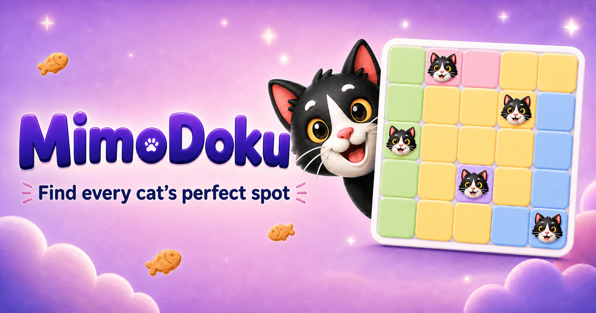

# MimoDoku

A cozy, browser-based cat-placement Sudoku puzzle built with TanStack Start,
React, and Cloudflare Workers.



## Features

- 80 handcrafted logic puzzles
- Deterministic daily puzzle
- English and Chinese interfaces
- Mouse, touch, and keyboard-friendly controls
- Automatic marking, hints, undo, and session restore
- Local progress, completion history, and ranking
- Music, sound, haptics, and reduced-motion preferences
- Responsive desktop and mobile layouts

## Tech stack

- TanStack Start
- TanStack Router
- React 19
- TypeScript
- Cloudflare Workers
- Playwright
- Biome

## Development

```bash
pnpm install
pnpm dev
```

The local application is available at `http://localhost:3000`.

## Test

```bash
pnpm check
pnpm e2e
pnpm build
```

## Deployment

Log in to Cloudflare once:

```bash
pnpm exec wrangler login
```

Deploy the production Worker:

```bash
pnpm run deploy
```

## Routes

| Route | Purpose |
| --- | --- |
| `/` | Game menu |
| `/levels` | Level selection |
| `/play?level=1` | Handcrafted level |
| `/play?mode=daily` | Daily puzzle |
| `/ranking` | Local completion history |
| `/settings` | Language and game preferences |
| `/how-to-play` | Rules and controls |

## Related open-source games

This project belongs to the same small collection of standalone browser games:

- [game-blocks](https://github.com/open-fox/game-blocks) — a lightweight block
  puzzle with classic and daily modes
- [game-poly](https://github.com/open-fox/game-poly) — a browser port of the
  original level-based 8×8 block-fitting puzzle

## Build more with TanStarter

MimoDoku is intentionally kept small and focused, but it originally grew out
of a project built with [TanStarter](https://tanstarter.dev).

If you want to turn a game, tool, or product idea into a complete SaaS,
TanStarter provides a production-ready TanStack Start boilerplate with auth,
payments, AI, storage, email, newsletters, a blog, dashboard, i18n, SEO, and
Cloudflare Workers deployment.

**Ship Faster with TanStack, Cost Less with Cloudflare.**

- [TanStarter website](https://tanstarter.dev)
- [Live demo](https://demo.tanstarter.dev)
- [Documentation](https://docs.tanstarter.dev)
- [Video tutorials](https://www.youtube.com/@TanStarter)

## Asset notice

Third-party packages and binary asset notes are documented in
[THIRD_PARTY_NOTICES.md](./THIRD_PARTY_NOTICES.md).

If you are a rights holder and believe an asset should be removed, please open
an issue or contact the repository maintainer.

## Author

[OpenFox](https://mksaas.link/fox-x) is an independent developer building products and developer tools. His products include:

- [TanStarter](https://tanstarter.dev) — Ship Faster with TanStack, Cost Less with Cloudflare.
- [MkSaaS](https://mksaas.com) — Make Your AI SaaS Product in a Weekend.
- [MkImage](https://mkimage.ai) — Make Any Images Possible.
- [MkDirs](https://mkdirs.com) — Launch AI-powered directory in 30 minutes.
- [MkDollar](https://mkdollar.com) — The all-in-one platform to help you make first dollar online.

## License

Source code is released under the [MIT License](./LICENSE). Third-party assets
may be subject to separate rights described in
[THIRD_PARTY_NOTICES.md](./THIRD_PARTY_NOTICES.md).
